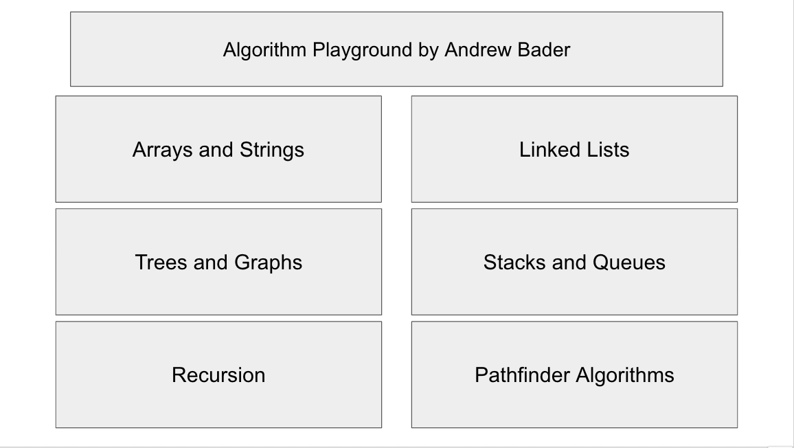
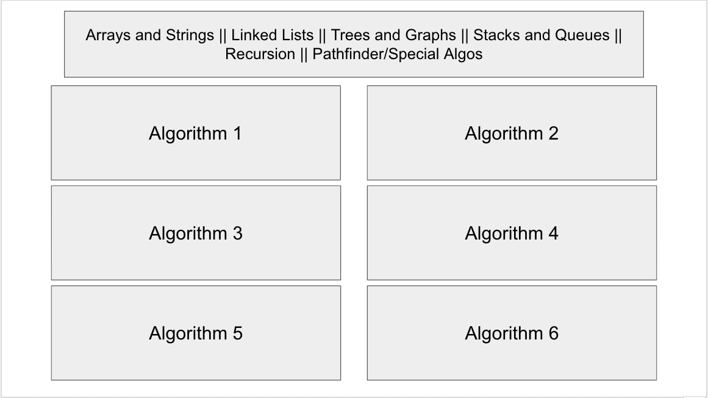
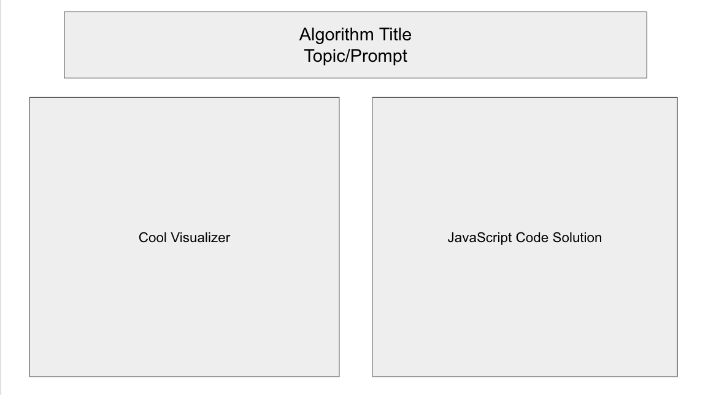

Algorithms Playground!!

I am making a fun algorithms playground fullstack MEN app with MongoDB, Express, and Node.js with a number of fun and interesting features!

I will focus on visualizing various algorithms and solutions with fun images, graphs and other visually stimulating interpretations of various algorithms and code blocks.

The different categories I would like to consider adding to the Algorithm's Playground app include:
1) Visulaizing arrays and strings
    - including different algorithms like insertion, sorting, deletion etc.

2) visualizing linked lists
    - visualizing single/double/circular lists maybe as snakes or something along those lines
    - visualizing different processing such as insertion, finding and deletion

3) visualizing stacks and queues
    - using block stacks or line queues to visualize different types of stacks/queues and stack/queue related algorithms

4) visualizing trees and graphs
    - using diagrams to show different kinds of trees ie binary trees, binary search trees, tries
    - using visual diagrams to show different tree and graph processing algorithms

5) visualizing recurion
    - showing different recursion algorithms ie fibonacci etc
    - maybe trying to show promises and call backs some how as well

6) pathfinder algorithms
    - cool search pathfinder algorithms

ERD => will be many solutions and algorithms of a category to an algorithm-set-category ie. There will be a one to many general visualizer method to many algorithms. ie multiple list algorithms visualized by a snake diagram component/function

- solutions will be stored in a similar manner to my project 3, but I will have functional algorithms for each show page as well that runs the visualizer

User flow/wire frames: 

The user will be brought to an algorithms-playground page with algorithm topics to select from such as the list above:

The user can then select one of the algorithm categories and will be directed to an index page of prompts for that type of topic
- this will be similar to my project 3 for each topic type

The user will be brought to an algo-prompt show page with a cool visualer at the left and the JS code to the right. It will be a fun way to learn algos!!

Will try some user auth as well!

